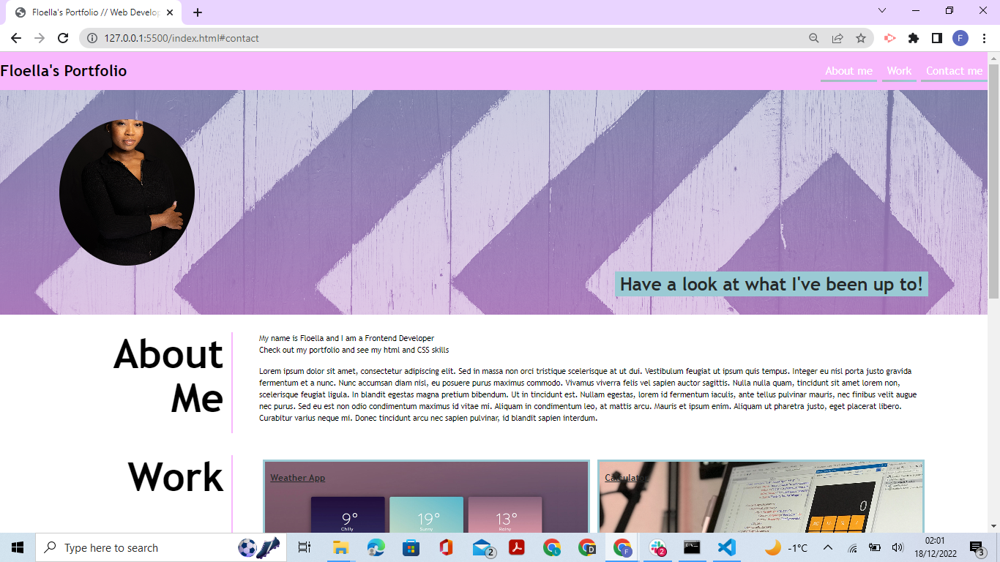

# css-skills-portfolio

## Web developer portfolio

This repository is where I built my portfolio for employers to be able to see my web development projects. I used HTML CSS flexbox and CSS grids to create this portfolio. The creation of this portfolio will be benefitial as it showcases all my projects and contact information which will allow future employers to view my work and contact me.

## Deployed Link
https://ellaflo.github.io/css-skills-portfolio/

## Repository Link is the source code
https://github.com/ellaflo/css-skills-portfolio

## Installation
N/A

## Usage

## Credits
N/A

## License
Please refer to the LICENSE in the repo.